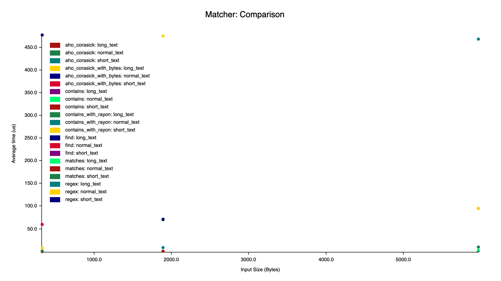
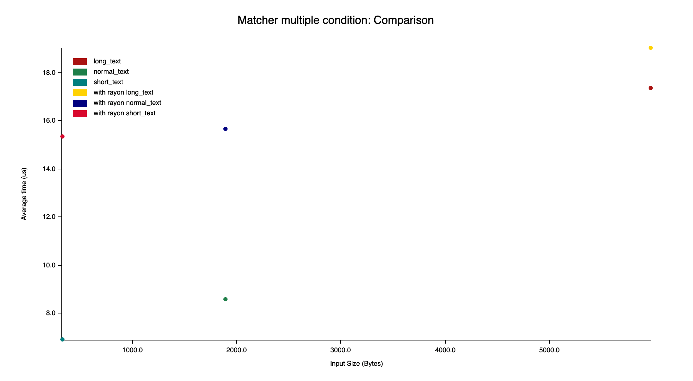

# Matching Keyword

> Keywords from JSON that match in CSV

## Features ✨
- Include words
- Exclude words
- Support operators AND or `+` to find words containing all terms separated

## Quick Start ⚡️

```bash
cargo run
```

## Tests 🧪

```bash
cargo test
```

## Benchmark 🚀

```bash
cargo bench
```

## Results 📊
Benchmark System:
- MacBook Pro 13 2020 Intel Core i5 Gen10 RAM 16GB
- rust 1.54.0


<p align="center">
    
</p>

---

<p align="center">
    
</p>
